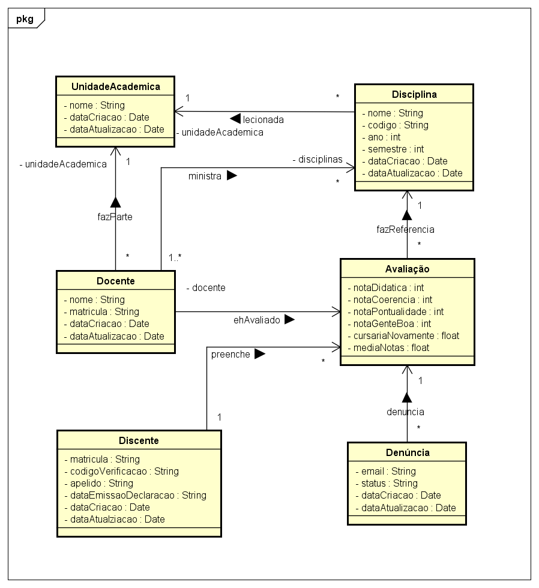
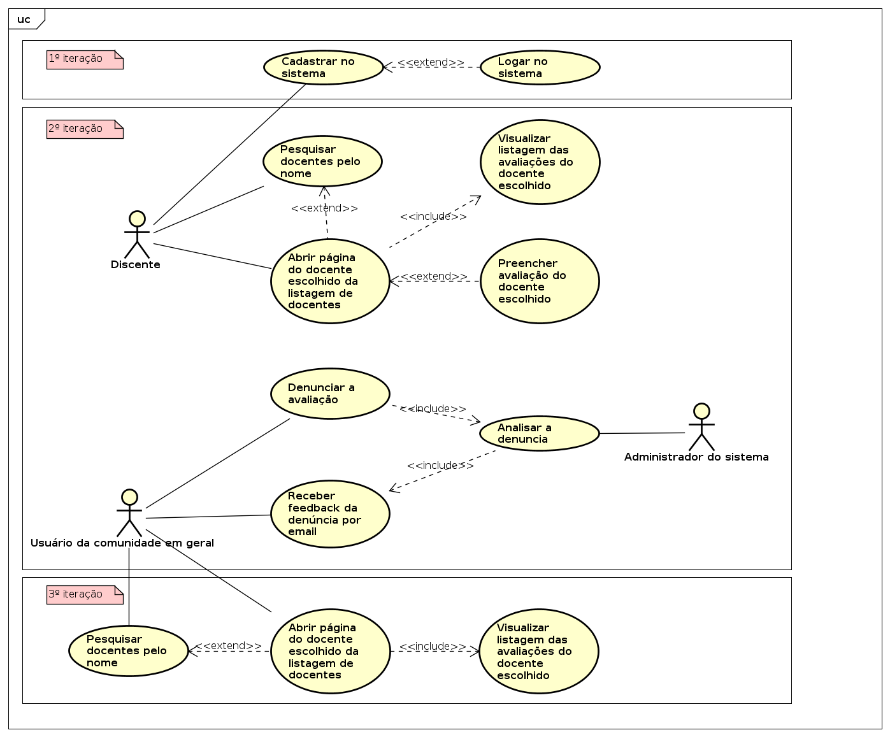

## 👨‍🏫 ConsultaProf

Plataforma para que alunos possam avaliar e consultar as avaliações disponíveis de docentes de uma universidade/unidade acadêmica.

### API

### App

### Identificação dos componentes do grupo

- Gustavo Henrique Rodrigues Santos Silva
- João Carlos Fonseca
- José da Costa Nunes Neto

> **Problema**: Os alunos do Instituto de Informática não conseguem obter informações, antes da
matrícula, acerca dos docentes das disciplinas que irão cursar, já que a avaliação
institucional existente, apesar de ser realizada pelos alunos, tem seus resultados
destinados aos docentes. Com isso, pouca ou quase nenhuma informação acerca da
avaliação do docente é disponibilizada aos discentes: apenas a média geral do docente
e o desvio padrão dessa média. Dados que são demasiadamente abstratos e que
fornecem praticamente nenhuma informação acerca do docente em questão. Isso
dificulta a escolha das disciplinas pelo discente.

> **Objetivo**: O objetivo é criar uma plataforma em que os alunos possam avaliar e consultar as
avaliações disponíveis de docentes de uma universidade/unidade acadêmica.

### Identificação dos componentes do sistema

- Portal UFGNet
- Sistema de Informação de Atividades Acadêmicas da UFG (SIGAA)

### Identificação dos usuários finais

- Discentes do Instituto de Informática da UFG. Eles irão avaliar e consultar
avaliações anteriores dos discentes.
- Docentes do Instituto de Informática da UFG.
- Moderador: responsável pela fiscalização dos comentários e por atender
pedidos de exclusão de avaliações.

### Fontes de requisitos

- Discentes: questionário online (visa identificar pontos essenciais que devem
constar na avaliação do docente).
- Docentes: entrevistas (visa identificar restrições que a avaliação deve obedecer).
- Comissão de avaliação institucional da UFG: entrevista (podem nos auxiliar com
a visão que possuem sobre esse tipo de avaliação).

### Requisitos funcionais

#### RF01

Como discente, desejo validar minha conta do SIGAA para que possa acessar o
sistema e realizar avaliações. Os dados necessários para a validação são: matrícula, o
código de verificação e data de emissão da declaração de vínculo.

#### RF02

Como docente, desejo requisitar um pedido de exclusão da avaliação para que não
tenha comentários que ofendam o docente ou não sejam verdade. Esse pedido será
avaliado pelo moderador e o docente será notificado através do e-mail.

#### RF03

Como sistema ConsultaProf, desejo importar do Portal UFGNet os dados de
professores para que possa disponibilizar uma listagem dos professores para que os
docentes escolham quem irão avaliar.

#### RF04

Como sistema ConsultaProf, desejo importar do SIGAA os dados dos alunos do INF
para que possa validar o login do discente.

#### RF05

Como discente, desejo avaliar o docente para que tenha conteúdo onde os alunos
possam consultar. Os dados relativos à disciplina avaliada são:

- Nome;
- Código;
- Ano e semestre que foi ministrada;
- Horário.

A avaliação do docente correspondem a notas (no intervalo de 1 a 5) relativas aos
seguintes critérios:

- Didática;
- Coerência das avaliações;
- Pontualidade;
- Relacionamento com o aluno.

A avaliação contém também o critério “Cursaria alguma disciplina com o docente
novamente?”, no qual a resposta pode ser “Sim” ou “Não”. Por fim, o discente pode
complementar sua avaliação adicionando um comentário e um título para o comentário.

#### RF06

Como usuário, desejo buscar o docente pelo nome para que seja mais fácil de
encontrá-lo.

#### RF07

Como discente, desejo poder editar a avaliação do docente para que possa corrigir
algum erro no momento da avaliação do discente.

#### RF08

Como​ discente, desejo​ poder excluir a avaliação do docente.

#### RF09

Como discente, desejo escolher um nome/apelido no cadastro para não revelar minha
identidade.

### Requisitos não-funcionais

#### RNF01

O sistema deve ser acessível através da plataforma móvel Android.

#### RNF02

As interfaces devem ser intuitivas, isto é, o usuário saberá usá-lo sem ler um manual
ou qualquer tipo de treinamento, visto que o sistema será usado como entretenimento
por usuários heterogêneos.

#### RNF03

O sistema utilizará a versão 2.5 da linguagem Dart para o cliente mobile e TypeScript
rodando no NodeJS para o servidor. Essas escolhas foram feitas baseadas na fácil
curva de aprendizagem com essas linguagens e facilidade que existe para se trabalhar
com web service com NodeJS.

#### RNF04

A IDE utilizada para o desenvolvimento do cliente mobile será Intellij IDEA, utilizando a tecnologia Flutter.

#### RNF05

A IDE utilizada para o desenvolvimento do servidor será Microsoft Visual Studio Code,
usando TypeScript.

#### RNF06

O SGDB a ser utilizado será o MySQL. Essa escolha foi feita porque essa tecnologia
tem uma boa performance e é altamente escalável.

#### RNF07

O versionamento do projeto deve ser realizado pelo GitHub.

#### RNF08

Os testes do projeto devem ser realizados pela integração do Travis CI ao GitHub.

### Diagrama de casos de uso:

### Casos de usos detalhados

#### Caso de uso 01:

	Nome: Avaliar docente.
	Ator principal​: Discente.
	Interessados e interesses​: Discente, Moderador.

	Pré-condições​:

	- Discente está autenticado.
	- Docente está registrado no sistema.

	Pós-condições (garantia de sucesso):

	- Avaliação realizada e submetida ao moderador,
	quem irá autorizar a publicação da avaliação.

	Cenário de sucesso principal:

	- Discente acessa a página inicial;
	- Procura pelo docente e acessa sua página;
	- Preenche os campos necessários e envia a sua avaliação.

#### Caso de uso 02:

	Nome: Contestar avaliação.
	Ator principal​: Docente.
	Interessados e interesses​: Moderador.
	Pré-condições​:
	- Docente possui ao menos uma avaliação.
	Pós-condições (garantia de sucesso):
	- A contestação será enviada ao moderador e notificada ao discente.
	Cenário de sucesso principal​:
	- Lê as avaliações já publicadas;
	- Escolhe a avaliação a ser contestada;
	- Contesta avaliação;
	- Insere seu endereço de e-mail;
	- Recebe um aviso de que a contestação será analisada;
	- Avaliação ficará indisponível até a análise, caso seja aceita a contestação ela
	ficará permanentemente indisponível, caso contrário, voltará a ser disponível.
	- Discente recebe notificação sobre a contestação.

#### Caso de uso 03:

	Nome: Cadastro de discente.
	Ator principal​: Discente.
	Interessados e interesses​: Discente.
	Pré-condições​:
	- Discente está matriculado na UFG.
	Pós-condições (garantia de sucesso): O discente será cadastrado e autenticado no
	app.
	Cenário de sucesso principal​:
	- Docente acessa de login.
	- Preenche os campos necessários: matrícula, data de emissão e identificador da declaração de vínculo.
	- Tem seu nome/apelido e senha usada.

#### Diagrama de classes:

#### Diagrama de casos de uso:

#### Cronograma:

|   ID   |  Assunto  |    Iteração    |    Fonte do requisito    |    Última atualização    |
| :---         |     :---:      |     :---:      |     :---:      |         ---: |
| E1     | Implementação da interface do cadastro de discente.     | 1   | RF01    | 22/10/2019    |
| E2     | Configuração do projeto no GitHub.       | 1      | RNF07    | 28/10/2019    |
| E3     | Projeto da aplicação em Flutter.       | 1      | RNF04    | 28/10/2019    |
| E4     | Projeto da API em TypeScript.       | 1      | RNF03, RNF05    | 28/10/2019    |
| E5     | Configuração do Travis CI para API.       | 1      | RNF08    | 28/10/2019    |
| E6     | Design do Banco de Dados.       | 1      | RNF06    | 28/10/2019    | git status    |
| E7     | Implementação da validação de cadastro pelo SIGAA. | 2            | RF01      | 25/11/2019    |
| E8     | Módulo para reportar avaliação.       | 2      | RF02    | 25/11/2019    |
| E9     | Módulo preenchimento de avaliação.       | 2      | RF05, RF07    | 25/11/2019    |

