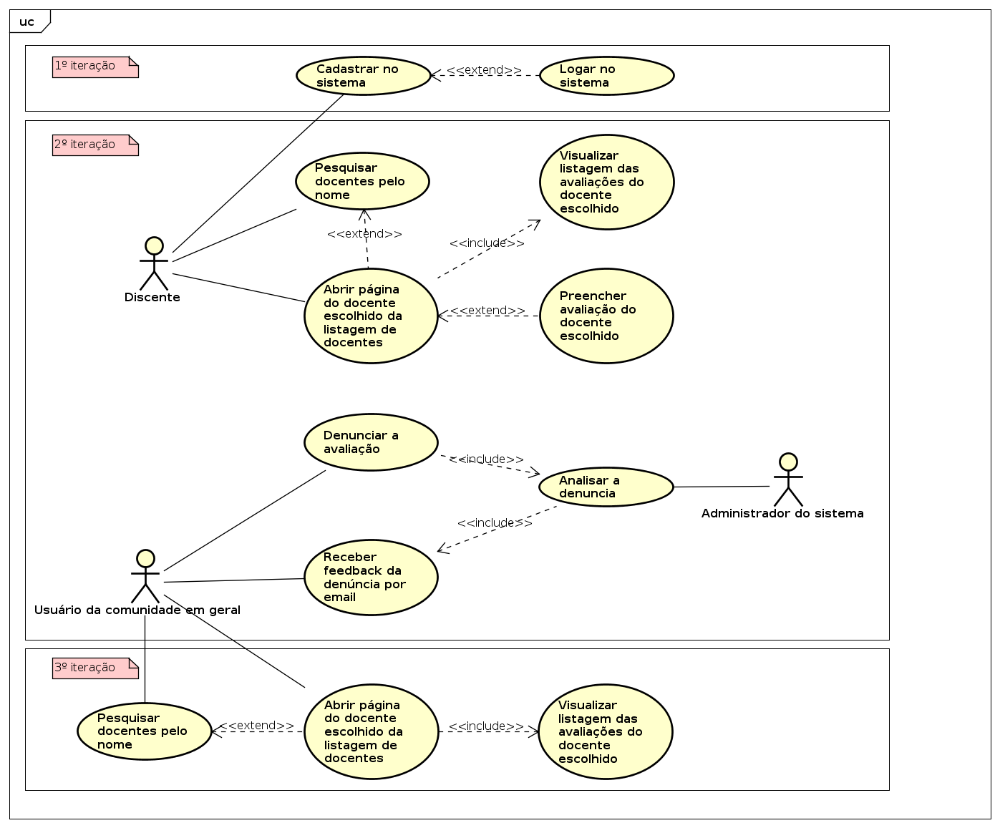

# 👨‍🏫 ConsultaProf

Plataforma para que alunos possam avaliar e consultar as avaliações disponíveis de docentes de uma universidade/unidade acadêmica.

## ConsultaProf NodeJS API

### Tecnologia e ferramentas

Este projeto de API conta com as seguintes tecnologias:
- NodeJS (10.x), TypeScript (3.5) e Express.

São utilizados para desenvolvimento as seguintes ferramentas:
- ESLint (análise estática) e Jest (testes unitários).

### Variáveis de ambiente

Definir as seguintes variáveis de ambiente com as credenciais do banco de dados MySQL: `CP_DB_HOST`, `CP_DB_USER`, `CP_DB_PASS` e `CP_DB_NAME`.

### Testes unitários

Execute o comando `npm run test` para realização dos testes unitários com Jest.

### Análise estática

Execute o comando `npm run lint` para a realização da análise estática do código em TypeScript.

### Documentação

Execute o comando `npm run doc` para gerar a documentação referente a api em `api/docs`.

## App

## Identificação dos componentes do grupo

- Gustavo Henrique Rodrigues Santos Silva
- João Carlos Fonseca
- José da Costa Nunes Neto

> **Problema**: Os alunos do Instituto de Informática não conseguem obter informações, antes da
matrícula, acerca dos docentes das disciplinas que irão cursar, já que a avaliação
institucional existente, apesar de ser realizada pelos alunos, tem seus resultados
destinados aos docentes. Com isso, pouca ou quase nenhuma informação acerca da
avaliação do docente é disponibilizada aos discentes: apenas a média geral do docente
e o desvio padrão dessa média. Dados que são demasiadamente abstratos e que
fornecem praticamente nenhuma informação acerca do docente em questão. Isso
dificulta a escolha das disciplinas pelo discente.

> **Objetivo**: O objetivo é criar uma plataforma em que os alunos possam avaliar e consultar as
avaliações disponíveis de docentes de uma universidade/unidade acadêmica.

### Identificação dos componentes do sistema

- Sistema de Informação de Atividades Acadêmicas da UFG (SIGAA)

### Identificação dos usuários finais

- Discentes: eles irão avaliar e consultar avaliações anteriores dos discentes.
- Comunidade em geral: poderão acessar as avaliações e denunciá-las se achar necessário, sem
que necessitem estar cadastrados no sistema para isso.

### Fontes de requisitos

- Discentes: questionário online (visa identificar pontos essenciais que devem
constar na avaliação do docente).
- Docentes: entrevistas (visa identificar restrições que a avaliação deve obedecer).
- Comissão de avaliação institucional da UFG: entrevista (podem nos auxiliar com
a visão que possuem sobre esse tipo de avaliação).

### Requisitos funcionais

#### RF01

Como discente, desejo me cadastrar para que possa acessar o
sistema e realizar avaliações. Os dados necessários para a cadastro são: matrícula, apelido, email e senha.

#### RF02

Como usuário da comunidade em geral, desejo poder denunciar avaliações ofensivas, caluniosas ou com informações erradas.
Esse pedido será avaliado pelos administradores do sistema e eu serei notificado por email ao final da avaliação da 
denúncia sobre as providências tomadas em relação a mesma.

#### RF03

Como sistema ConsultaProf, desejo importar os dados de docentes de determinada unidade acadêmica ou universidade
para que possa disponibilizar uma listagem dos professores para que os discentes escolham quem irão avaliar ou
consultar avaliações.

#### RF04

Como discente, desejo avaliar o docente para que tenha conteúdo onde os alunos
possam consultar. Os dados relativos à disciplina avaliada são:

- Nome;
- Código;
- Ano e semestre que foi ministrada;
- Horário.

A avaliação do docente correspondem a notas (no intervalo de 1 a 5) relativas aos
seguintes critérios:

- Didática;
- Coerência das avaliações;
- Pontualidade;
- Relacionamento com o aluno.

A avaliação contém também o critério “Cursaria alguma disciplina com o docente
novamente?”, no qual a resposta pode ser “Sim” ou “Não”. Por fim, o discente pode
complementar sua avaliação adicionando um comentário e um título para o comentário.

#### RF05

Como usuário da comunidade em geral, desejo buscar o docente pelo nome para que seja mais fácil de
encontrá-lo.

#### RF06

Como discente, desejo buscar o docente pelo nome para que seja mais fácil de
encontrá-lo.

#### RF07

Como discente, desejo escolher um apelido no cadastro para não revelar minha
identidade.

### Requisitos não-funcionais

#### RNF01

O sistema deve ser acessível através da plataforma móvel Android.

#### RNF02

As interfaces devem ser intuitivas, isto é, o usuário saberá usá-lo sem ler um manual
ou qualquer tipo de treinamento.

#### RNF03

O sistema utilizará a versão 2.5 da linguagem Dart para o cliente mobile e TypeScript
rodando no NodeJS para o servidor. Essas escolhas foram feitas baseadas no domínio destas linguagens
por alguns integrantes da equipe e pela facilidade que existe para se trabalhar com web service com NodeJS.

#### RNF04

A IDE utilizada para o desenvolvimento do cliente mobile será Intellij IDEA, utilizando a tecnologia Flutter.

#### RNF05

A IDE utilizada para o desenvolvimento do servidor será Microsoft Visual Studio Code,
usando TypeScript.

#### RNF06

O SGDB a ser utilizado será o MySQL. Essa escolha foi feita porque essa tecnologia
tem uma boa performance e é altamente escalável.

#### RNF07

O versionamento do projeto deve ser realizado pelo GitHub.

#### RNF08

Os testes do projeto devem ser realizados pela integração do Travis CI ao GitHub.

### Casos de usos detalhados

#### Caso de uso 01:

	Nome: Avaliar docente.
	Ator principal​: Discente.
	Interessados e interesses​: Discente, Moderador.

	Pré-condições​:

	- Discente está autenticado.
	- Docente está registrado no sistema.

	Pós-condições (garantia de sucesso):

	- Avaliação realizada e submetida ao moderador,
	quem irá autorizar a publicação da avaliação.

	Cenário de sucesso principal:

	- Discente acessa a página inicial;
	- Procura pelo docente e acessa sua página;
	- Preenche os campos necessários e envia a sua avaliação.

#### Caso de uso 02:

	Nome: Contestar avaliação.
	Ator principal​: Docente.
	Interessados e interesses​: Moderador.
	Pré-condições​:
	- Docente possui ao menos uma avaliação.
	Pós-condições (garantia de sucesso):
	- A contestação será enviada ao moderador e notificada ao discente.
	Cenário de sucesso principal​:
	- Lê as avaliações já publicadas;
	- Escolhe a avaliação a ser contestada;
	- Contesta avaliação;
	- Insere seu endereço de e-mail;
	- Recebe um aviso de que a contestação será analisada;
	- Avaliação ficará indisponível até a análise, caso seja aceita a contestação ela
	ficará permanentemente indisponível, caso contrário, voltará a ser disponível.
	- Discente recebe notificação sobre a contestação.

#### Caso de uso 03:

	Nome: Cadastro de discente.
	Ator principal​: Discente.
	Interessados e interesses​: Discente.
	Pré-condições​:
	- Discente está matriculado na UFG.
	Pós-condições (garantia de sucesso): O discente será cadastrado e autenticado no
	app.
	Cenário de sucesso principal​:
	- Docente acessa de login.
	- Preenche os campos necessários: matrícula, data de emissão e identificador da declaração de vínculo.
	- Tem seu nome/apelido e senha usada.

#### Diagrama de classes:

#### Diagrama de casos de uso:

#### Cronograma definido na primeira iteração:

|   ID   |  Assunto  |    Iteração    |    Fonte do requisito    |    Última atualização    |
| :---         |     :---:      |     :---:      |     :---:      |         ---: |
| E1     | Implementação da interface do cadastro de discente.     | 1   | RF01    | 22/10/2019    |
| E2     | Configuração do projeto no GitHub.       | 1      | RNF07    | 28/10/2019    |
| E3     | Projeto da aplicação em Flutter.       | 1      | RNF04    | 28/10/2019    |
| E4     | Projeto da API em TypeScript.       | 1      | RNF03, RNF05    | 28/10/2019    |
| E5     | Configuração do Travis CI para API.       | 1      | RNF08    | 28/10/2019    |
| E6     | Design do Banco de Dados.       | 1      | RNF06    | 28/10/2019    |
| E7     | Módulo para reportar avaliação.       | 2      | RF02    | 25/11/2019    |
| E8     | Módulo preenchimento de avaliação.       | 2      | RF05, RF07    | 25/11/2019    |
| E9     | Implementação da interface de preenchimento de avaliação.     | 2      | RNF02   | 25/11/2019    |
| E10    | Implementação da interface de denúncia de avaliação.     | 2      | RNF02   | 25/11/2019    |
| E11    | Implementação da interface listagem de professores e avaliações.     | 2      | RNF02   | 25/11/2019    |

#### Subdivisão das tarefas para a segunda iteração:

|   ID   |  Atividade  |    Responsáveis    |
| :---         |     :---:      |         ---: |
| 1     | Artefatos implementados na 1a e 2a iterações: casos de uso, diagrama de classes e do repositório de dados (e.x. DER)    |  João Carlos  |
| 2     | Camada de persistência de dados       | João Carlos |
| 3     | Camada de lógica de negócio       | José Costa |
| 4     | Camada de apresentação        | Gustavo Henrique |
| 5     | Percentual de cobertura dos requisitos da 2a iteração      | João Carlos |
| 6     | Integração contínua (estilo Maven)       | José Costa |
| 7     | Documentação do projeto (estilo Javadoc) | João Carlos |
| 8     | Relatório de análise estática de código do projeto       | José Costa |

